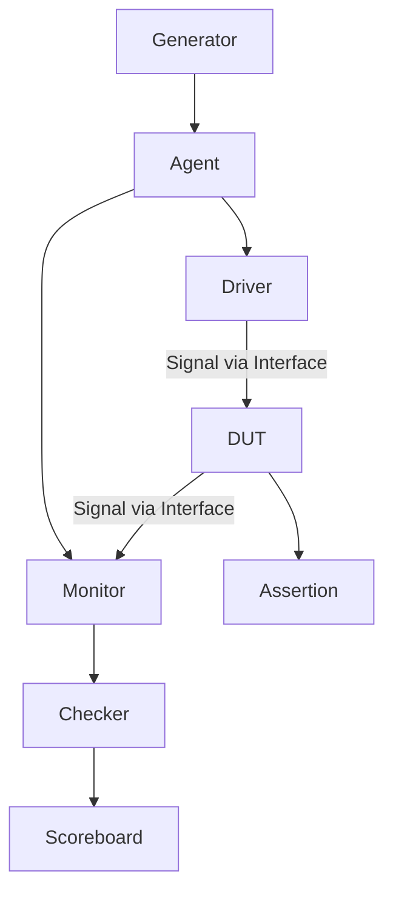

> In a test plan consisting of the following blocks: Generator, Agent, Driver, DUT, Assertion, Monitor, Checker, and Scoreboard — what is the role of each block, what should be coded in each, and where should the interface be placed? Also, use Mermaid to describe how these blocks are connected.

# Role of each block

| Block          | Chức năng chính (Tiếng Việt)                                                              | Main Role (English)                                                    |
| -------------- | ----------------------------------------------------------------------------------------- | ---------------------------------------------------------------------- |
| **Generator**  | Sinh ra các transaction (dữ liệu test), có thể ngẫu nhiên hoặc theo mẫu                   | Generates test transactions (randomized or directed)                   |
| **Agent**      | Gom nhóm Driver + Monitor, điều phối hoạt động của cả hai                                 | A container for Driver and Monitor (coordinates their operation)       |
| **Driver**     | Nhận transaction từ Generator và điều khiển DUT qua Interface                             | Converts transactions into pin-level DUT signals via the interface     |
| **DUT**        | Mạch thiết kế cần kiểm thử                                                                | The Design Under Test (actual hardware logic)                          |
| **Assertion**  | Kiểm tra logic, giao thức, quy tắc ngay trong DUT hoặc tại interface level                | Checks protocol and design rules (immediate or concurrent assertions)  |
| **Monitor**    | Theo dõi tín hiệu từ DUT, ghi nhận hoạt động và gửi transaction ra cho checker/scoreboard | Observes DUT signals and converts them back to high-level transactions |
| **Checker**    | So sánh logic cơ bản: dữ liệu có đúng không? phản ứng đúng thời điểm chưa?                | Performs basic checking and validation                                 |
| **Scoreboard** | So sánh kết quả DUT với mô hình tham chiếu (expected output)                              | Compares DUT output with reference model output                        |

# What to code inside each block

| Block          | Nên code gì (Tiếng Việt)                                                                       | What to code (English)                                                       |
| -------------- | ---------------------------------------------------------------------------------------------- | ---------------------------------------------------------------------------- |
| **Generator**  | Lớp `transaction` (`vmm_data`, `uvm_sequence_item`) và hàm `randomize()`                       | Transaction class and random logic (`randomize()`, constraints)              |
| **Agent**      | Instantiates Driver + Monitor; có thể bật/tắt agent kiểu active/passive                        | Instantiate and control driver/monitor instances                             |
| **Driver**     | Task `drive()` để lấy transaction từ mailbox/seq và gán tín hiệu vào DUT thông qua `interface` | Drive method to push signals onto DUT via interface                          |
| **DUT**        | Không viết trong testbench – đây là module bạn cần kiểm thử                                    | The hardware you are verifying                                               |
| **Assertion**  | Các câu lệnh `assert`, `property`, hoặc SystemVerilog assertion trong module hoặc interface    | `assert`, `property`, or `assert property` (immediate/concurrent assertions) |
| **Monitor**    | Task quan sát tín hiệu DUT, tạo transaction ngược lại và gửi tới checker/scoreboard            | Monitors signal, reconstructs transactions, sends to scoreboard/checker      |
| **Checker**    | Hàm hoặc task so sánh từng dữ liệu, kiểm tra logic, timing                                     | Basic comparison logic, checks for correctness                               |
| **Scoreboard** | Duy trì hàng đợi các transaction, so sánh kết quả DUT với mô hình tham chiếu                   | Keeps a queue of expected vs actual results                                  |

# How blocks are connected

